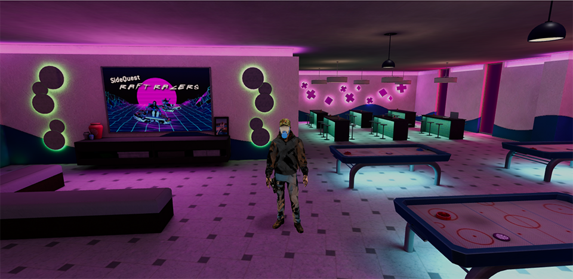

<h1 align="center">Character Simulator</h1>

<p align="center">

</p>

<p align="center">
<b><i>Character Simulator(Walk Simulator)</i></b> 🎮 is an exciting game developed using the three.js technology stack, offering players an immersive virtual world to explore. In this game, you'll experience precise collision detection between the scenery and the characters, ensuring a realistic and smooth gaming experience. Additionally, the game features a dual-person perspective switch, allowing you to seamlessly switch between the first-person and third-person views, enhancing your ability to explore the game world. To optimize performance, the camera occlusion optimization feature has been cleverly applied, providing you with smoother game visuals and animations. Moreover, "Walk Simulator" incorporates elements of NES game simulation, allowing you to relive the nostalgia of classic games. Whether you're exploring unknown worlds or taking on various gaming challenges, you'll find joy and excitement in <b><i>Character Simulator(Walk Simulator)</i></b>!
</p>

:cn:[中文](./README_ZH.md)

## How to operate?
walk: `W`/`S`/`A`/`D`  

jump: `Space`

view: `left mouse button`  

Switch person perspective: `V`

Trigger Interaction: `F`

## Features

- [x] First and Third Person Perspective Switch.
- [x] High-Performance Collision Detection.
- [x] Third-Person Camera Occlusion Handling.
- [x] Interactive Box Detection.
- [x] NES Game Emulation.

## Additional Note
Although this project is developed using `Vue3` and `TypeScript`, the core functionalities are still encapsulated using an object-oriented approach. Vue code is less invasive, allowing for easier migration to other technology stacks for developers.

## Directory structure description
```text
├── src                             # Source code
│   ├── application                 # Core game source code section
|   |    │── audio                  # Audio class (create positional audio)
|   |    │── character              # Character class (character model control)
|   |    │── control                # Keyboard control class (keyboard key state management)
|   |    │── core                   # Core base class (includes camera, renderer, scene, etc.)
|   |    │── environment            # Environment class (create map models, lights, scene textures)
|   |    │── InteractionDetection   # Interaction detection class (intersection detection between character box and interaction box triggers)
|   |    │── loader                 # Loader class (fbx, glb, audio, etc. loader management)
|   |    │── utils                  # Utility functions
|   |    |    │── Emitter.ts        # Event emitter class (dispatch various events)
|   |    |    └── typeAssert.ts     # Type inference utility functions
|   |    │── world                  # Core game class (used to manage core elements in the game world, including environment, character, interaction detection, and audio components)
|   |    └── Constants.ts           # Constant definitions (define model/texture/media resource paths, event dispatch names, etc.)
│   ├── assets          # Resource folder
|   |    │── audio      # Audio files
|   |    │── font       # Font files
|   |    │── img        # Image files
|   |    │── models     # Model files
|   |    │── nes        # Nes game files
|   |    └── main.css   # Global stylesheet
│   ├── components      # vue组件
|   |    │── LoadProgress.vue   # Loading component
|   |    │── NesGameDialog.vue  # Nes game dialog component (run Nes games)
|   |    └── NotifyTips.vue     # Interaction notification component
│   ├── typings     # Type declarations
│   ├── App.vue     # Entry page
│   └── main.js     # Entry file (load components, global styles, initialization, etc.)
```

## Donate
Open source is not easy, your support is my continuous motivation! This project is an open source project, donations are voluntary.


## Project Setup

```sh
npm install
```

## Compile and Hot-Reload for Development

```sh
npm run dev
```

## Type-Check, Compile and Minify for Production

```sh
npm run build
```
