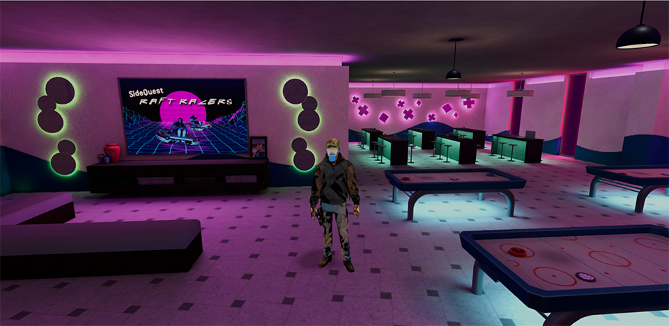

<h1 align="center">《走路模拟器》</h1>

<p align="center">

</p>

<p align="center">
<b>《走路模拟器》（Walk Simulator）</b> 🎮 是一款基于three.js技术栈开发的游戏，为玩家提供了一个引人入胜的虚拟世界。在游戏中，你将体验到场景与角色的精准碰撞检测，使得你的游戏体验更加真实和流畅。同时，游戏还支持双人称切换功能，让你可以在第一人称和第三人称视角之间自由切换，以便更好地探索游戏世界。为了提升游戏性能，相机遮挡优化功能也被巧妙地应用，让你感受到更顺畅的游戏画面和动画。另外，游戏还特别加入了NES模拟游戏的元素，让你重温经典怀旧的游戏体验。不管是探索未知的世界，还是挑战各种游戏任务，你都能在《走路模拟器》中找到乐趣与挑战！
</p>

## 如何操作?
行走：`W`/`S`/`A`/`D`

跳跃：`空格`

控制视角：`鼠标左键`

切换人称视角: `V`

触发交互: `F`

## 特色

- [x] 双人称切换
- [x] 高性能碰撞检测
- [x] 第三人称相机遮挡处理
- [x] 交互盒子检测
- [x] NES游戏模拟

## 说明
虽然本项目采用`Vue3` + `TypeScript`开发，但仍然采用面向对象的方式封装核心部分的代码，Vue代码部分侵入性较小，这样做的目的是方便开发者们向其他技术栈的迁移。

## 目录结构说明
```text
├── src                             # 源代码
│   ├── application                 # 游戏核心源码部分
|   |    │── audio                  # 音频类（创建位置音频）
|   |    │── character              # 人物角色类（人物模型控制）
|   |    │── control                # 键盘控制类（键盘按键状态管理）
|   |    │── core                   # 核心基础类（包括camera、renderer、scene等）
|   |    │── emitter                # 事件分发类（各类事件的分发）
|   |    │── environment            # 场景类（创建地图模型、灯光、场景贴图）
|   |    │── interactionDetection   # 交互检测类（角色盒子与交互盒子的相交触发检测）
|   |    │── loader                 # 加载器类（fbx、glb、audio等加载器管理）
|   |    │── utils                  # 工具函数
|   |    |    └── typeAssert.ts     # 类型推导工具函数
|   |    │── world          # 游戏核心类（用于管理游戏世界中的核心元素，包括环境、角色、交互探测和音频等组件）
|   |    └── Constants.ts   # 常量定义（定义模型/贴图/媒体资源地址、分发事件名等）
│   ├── assets          # 资源文件夹
|   |    │── audio      # 音频文件
|   |    │── font       # 字体文件
|   |    │── img        # 图片文件
|   |    │── models     # 模型文件
|   |    │── nes        # nes游戏文件
|   |    └── main.css   # 全局样式
│   ├── components      # vue组件
|   |    │── LoadProgress.vue   # 加载组件
|   |    │── NesGameDialog.vue  # nes游戏弹窗组件（运行nes游戏）
|   |    └── NotifyTips.vue     # 交互提示组件
│   ├── typings     # 类型声明
│   ├── App.vue     # 入口页面
│   └── main.js     # 入口文件（加载组件、全局样式、初始化等）
```

## 捐赠
开源不易，你的支持，就是我的源源不断的动力！本项目为开源项目，捐赠均为自愿。


## 安装

```sh
npm install
```

## 项目启动

```sh
npm run dev
```

## 构建打包

```sh
npm run build
```
